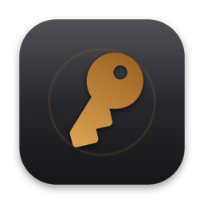
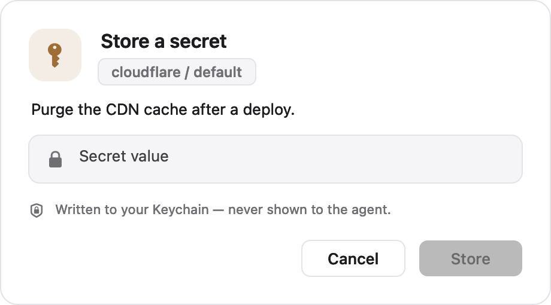
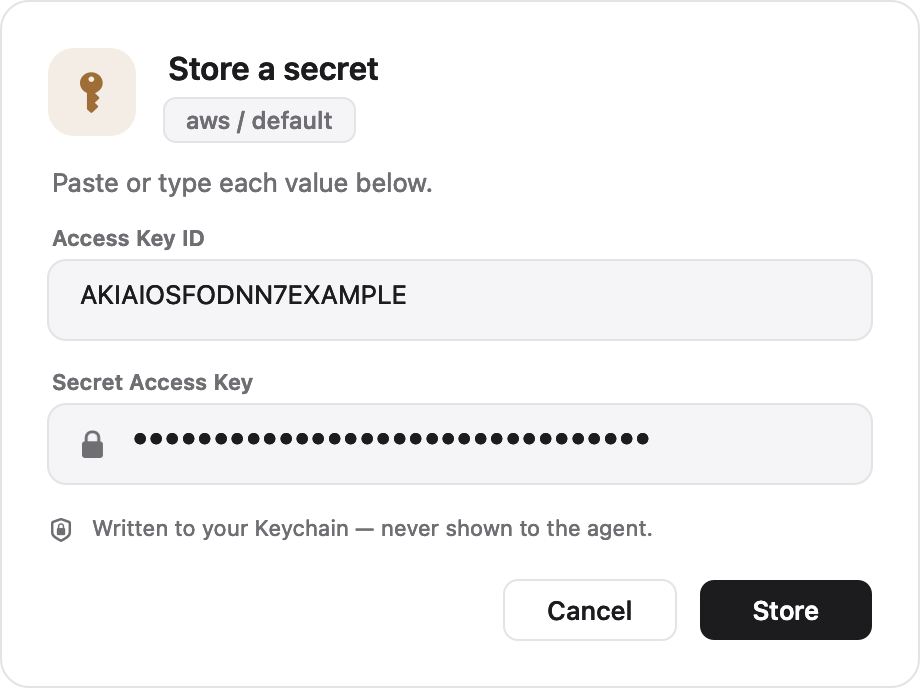

<p align="center">
  
</p>

<h1 align="center">mytokens — User Guide</h1>

<p align="center">
  Keep your API tokens, keys, and connection strings in the macOS <b>iCloud Keychain</b>,
  and let Claude fetch them at the moment it calls an API — without you ever pasting a
  secret into a chat.
</p>

---

## What it is, in one minute

- You store a secret **once**, in a small secure popup. It goes straight into your Keychain.
- Later, when Claude needs that secret to run a command, it reads it from the Keychain
  itself and uses it **inline** — the value never appears in the conversation.
- The value is entered and read only by a **signed macOS Helper**; Claude sees *that a
  secret exists* and its purpose, never the value.

You interact with two things: a one-line command (`mytokens …`, usually run by Claude) and
an occasional **secure popup** when a new secret needs to be stored. This guide walks
through exactly what you'll see.

---

## 1. Install

### Add the skill

```sh
npx skills add sunfmin/mytokens
```

This makes Claude aware of `mytokens`. From now on, before Claude asks you for a credential,
it checks the Keychain first.

### The app installs itself on first use

The `mytokens` command is a small signed app. The first time Claude needs it, it runs the
bundled installer, which downloads the notarized app, puts it in `~/Applications`, links the
`mytokens` command into `~/.local/bin`, and runs a self-check. You can also run it yourself:

```sh
bash ~/.claude/skills/mytokens/scripts/install.sh
```

You'll see it finish with a self-test — this confirms the Keychain works on your Mac:

```
upsert+get=true · list=true · delete=true · gone=true
SELFTEST PASS
```

> macOS only. If the command isn't found afterwards, add `~/.local/bin` to your `PATH`
> (the installer prints the exact line).

---

## 2. Store your first secret — step by step

When a secret isn't stored yet, Claude runs a command like this (you can run it too):

```sh
mytokens add cloudflare --description "Purge the CDN cache after a deploy"
```

**What happens:** a secure window appears. Nothing is stored until you fill it in and click
**Store**.

<p align="center">
  
</p>

Reading the window top to bottom:

| What you see | What it means |
|---|---|
| 🔑 **brass key badge** | This is the mytokens Helper asking to store a secret. |
| **Store a secret** | The action. |
| `cloudflare / default` chip | **Which** secret you're storing — the service and account. Confirm it's the one you expect before pasting. |
| *"Purge the CDN cache after a deploy."* | **Why** the popup appeared — the note Claude wrote so you (and a later session) know what this secret is for. |
| the field with a 🔒 | Where you type or paste the value. It's **masked** — shown as dots. |
| *Written to your Keychain — never shown to the agent* | Where the value goes, and the promise: Claude never receives it. |
| **Cancel / Store** | **Store** stays greyed out until the field has a value. Cancel writes nothing. |

**Step 1 — paste or type the value.** Copy your Cloudflare token and paste it (⌘V) into the
field. It shows as dots.

**Step 2 — click Store.** The window closes and the command prints:

```
stored cloudflare/default
```

That's it. The token is now in your Keychain. It never touched the chat, your shell history,
or Claude.

---

## 3. Store a multi-part credential (e.g. key + secret)

Some credentials come in pieces — an AWS **Access Key ID** *and* **Secret Access Key**, or a
database **username** + **password**. Claude collects them in **one** popup:

```sh
mytokens add aws --description "CI deploy: S3 uploads" \
                 --fields "Access Key ID","Secret Access Key" --show "Access Key ID"
```

<p align="center">
  
</p>

- One labelled row per field.
- **Access Key ID** is shown as plain text (it's an identifier, not a secret) so you can
  eyeball that you pasted the right one. It was marked with `--show`.
- **Secret Access Key** is masked.
- **Store** turns on only when **every** field is filled — you can't save half a credential.

The whole thing is saved as one credential and rotates or deletes as a unit.

---

## 4. Use your secrets

You rarely run these yourself — Claude does — but here's what they do.

**See what's stored** (never shows values):

```sh
$ mytokens list
cloudflare/default	parent
aws/default	static  — CI deploy: S3 uploads  fields: Access Key ID, Secret Access Key
```

Each line shows the service/account, its kind, the description, and (for multi-part
credentials) the field names — **never the secret itself**.

**Fetch a value** (Claude uses this inline, e.g. inside a `curl`):

```sh
mytokens get cloudflare                       # a single secret → the raw value
mytokens get aws --field "Secret Access Key"  # one field of a multi-part credential
```

For example, Claude runs things like:

```sh
curl -H "Authorization: Bearer $(mytokens get cloudflare)" https://api.cloudflare.com/...
```

so the token is used directly and never stored in a variable or printed.

---

## 5. Rotate or remove

```sh
mytokens add cloudflare --description "…"   # re-add to rotate: same popup, overwrites the old value
mytokens rm cloudflare                       # delete it entirely
```

---

## Where do the secrets live?

In **your** iCloud Keychain, under mytokens' own private area, written only by the signed
Helper. That means:

- ✅ They sync to your **other Macs** that have MyTokens installed (same Apple ID).
- ✅ You can see them with `mytokens list` or in **Keychain Access.app**.
- ❌ They do **not** appear in the **Passwords app** — that only lists website logins, not
  third-party API tokens. This is expected, not a bug.
- ❌ `/usr/bin/security` and unsigned scripts can't read them — only the signed Helper can.

---

## Is it safe?

The value is only ever typed into the Helper's secure field and written straight to the
Keychain; it's never sent to Claude. When Claude later *uses* a secret, the raw value does
pass through the command it runs (that's how it reaches the API) — mytokens assumes a
trusted, single-user Mac with FileVault on. See [`docs/adr/`](./docs/adr/) for the full
reasoning.

---

## Advanced

### Build & install from source

Prefer to build and sign it yourself (recommended if you'd rather not run someone else's
signed binary holding your secrets):

- macOS with **Xcode** and a **paid Apple Developer** signing identity (the iCloud
  data-protection keychain needs an entitlement only a signed app can carry — ADR-0001).
- [`xcodegen`](https://github.com/yonaskolb/XcodeGen) (`brew install xcodegen`).

```sh
make install      # xcodegen → signed build → ~/Applications/MyTokens.app + ~/.local/bin/mytokens
make verify       # show the signature + keychain-access-group
mytokens selftest # real-keychain round-trip — should print SELFTEST PASS
```

`project.yml` is the source of truth; the `.xcodeproj` is generated and git-ignored. The team
and bundle id live in `project.yml` (`DEVELOPMENT_TEAM`, `com.sunfmin.mytokens`) and the
access group in `mytokens.entitlements` — change all three together if you fork this. The app
icon is generated from code (`make icon`).

### Releasing (maintainers)

Built and published locally — no CI. Produce the notarized artifact and upload it:

```sh
# one-time: store notarization creds under a keychain profile
xcrun notarytool store-credentials mytokens --apple-id <you@example.com> \
      --team-id HL27PWAKDF --password <app-specific-password>

make dist NOTARY_PROFILE=mytokens   # → build/MyTokens.zip (Developer ID-signed, notarized, stapled)
make release TAG=v0.1.0             # → gh release create + upload MyTokens.zip
```

`scripts/install.sh` downloads `MyTokens.zip` from the **latest** Release, so bump `TAG` each
time. `make dist` uses your Developer ID cert (already in the keychain) and your
Xcode-logged-in account (for the Developer ID + Keychain-Sharing profile). Screenshots in
this guide are regenerated with `make screenshots`.

### How it's built

- Domain glossary: [`CONTEXT.md`](./CONTEXT.md)
- Decisions: [`docs/adr/`](./docs/adr/) — iCloud Keychain via a signed helper (0001), `get`
  returns the raw value (0002), a `.app` bundle (0003), minting (0004), multi-field
  Secrets (0005), per-Secret description (0006)
- Skill behavior for Claude: [`skills/mytokens/SKILL.md`](./skills/mytokens/SKILL.md)

## License

[MIT](./LICENSE)
